# Micron Technology (NASDAQ: MU)

* Fear of cyclic historical patterns being repeated
* Will this time be different?

## Overview

### Share Price
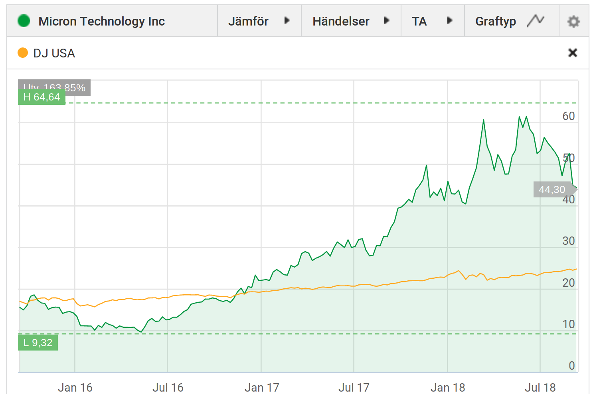

### EPS history

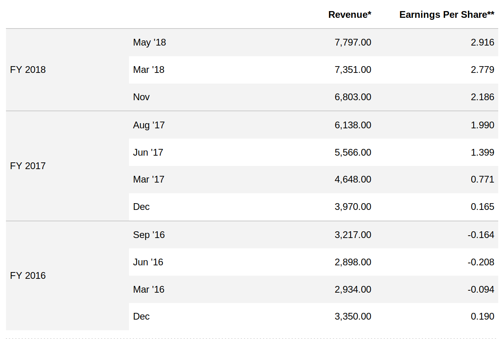

Source: [Reuters](https://www.reuters.com/finance/stocks/financial-highlights/MU.OQ)

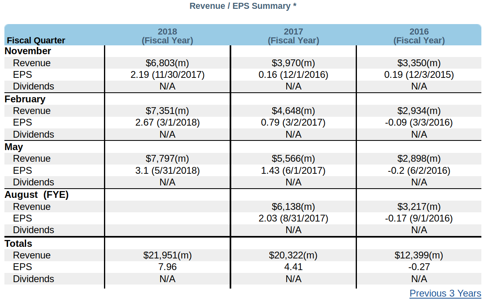

Source: [Nasdaq](https://www.nasdaq.com/symbol/mu/revenue-eps)

### EPS forecast
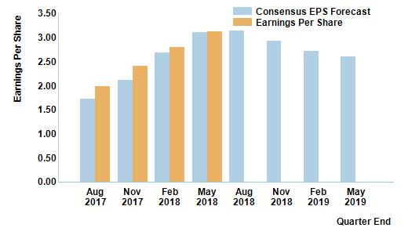

Source: [Nasdaq](https://www.nasdaq.com/symbol/mu/eps-forecast)

### Price/Earnings Ratio
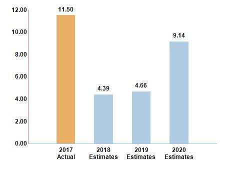

Source: [Nasdaq](https://www.nasdaq.com/symbol/mu/pe-ratio)

### Forecast Earnings

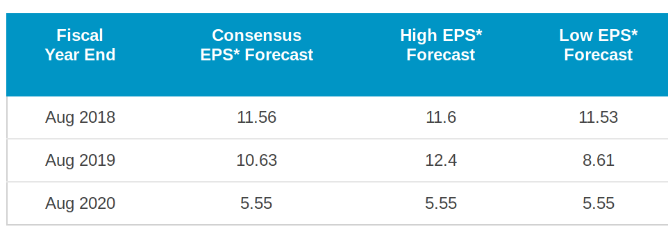

Source: [Nasdaq](https://www.nasdaq.com/symbol/mu/earnings-forecast)

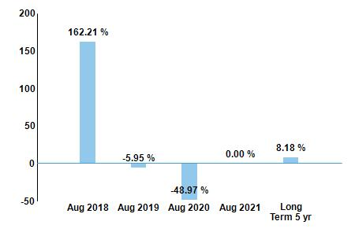

Source: [Nasdaq](https://www.nasdaq.com/symbol/mu/earnings-growth)

## Analyses

### Micron: Secular, Seasonal, Cyclical
Author: Joe Albano
[(Seeking Alpha)](https://seekingalpha.com/article/4205887-micron-secular-seasonal-cyclical)

__Cyclical profitability__
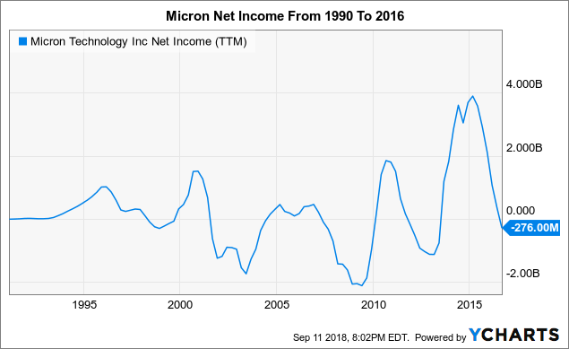

__Consolidation__
> Over the years DRAM manufacturers have halved, with 23 existing in 1997 to 11 existing in 2012 to today where only six exist by name (Samsung (OTC:SSNLF), SK Hynix, Micron, Nanya, Winbond, and Powerchip) with the top three claiming 95% of the most recent calendar quarter's revenue.

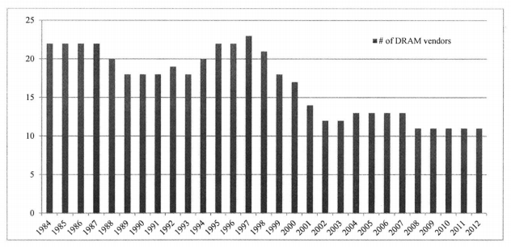

__DRAM price__

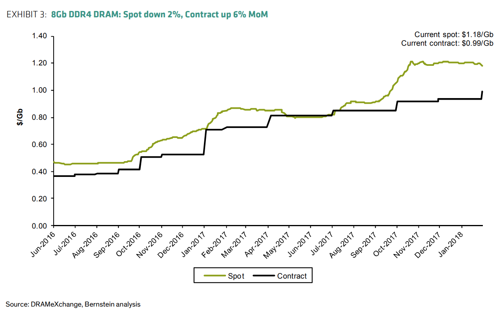
> While my opinion and analysis may not make you feel any better about your portfolio's pain, at least take this away: If predictions of analysts and Wall Street are wrong about what they expect (and they have been in the past, just recently, too) this is one of greatest the buying opportunities we may see from Micron. It won't take long to prove it's all due to fears of a return to a cyclical past. It may simply be analysts reading seasonality but claiming cyclicality while ignoring secularity.

### Micron: Why This Cycle Will Be Better
Author: Gary Alexander
[(Seeking Alpha)](https://seekingalpha.com/article/4205983-micron-cycle-will-better)

__Stronger balance sheet this time around, fueling buyback activity__
> The first post I want to touch on is the strength of Micron's balance sheet. Since the last cycle, Micron has made tremendous improvements in its cash position. At the nadir of Micron's last cycle and the lowest point in its share price history, where the stock dipped below $10 in 3Q15, the company held $5.65 billion of cash and marketable securities, against a gigantic debt load of $9.63 billion. This points to a net debt position of $3.98 billion:

> Fast forward two years to 3Q18, which is the last quarter Micron reported. The most recent balance sheet lists $7.56 billion worth of cash and marketable investments alongside $7.34 billion of debt, or a net cash position of $0.23 billion.

> This is a ~$4 billion improvement in Micron's liquidity position in just two years. Let's also not forget that in the first nine months of this year alone, Micron produced FCF of $5.44 billion ($12.24 billion in operating cash flows, less $7.80 billion of capex), so there's plenty more to where that came from.

> This cash flow run rate is the main reason Micron felt comfortable issuing a $10 billion buyback program. If the stock is down, all the better - Micron can repurchase billions of dollars in shares at a reduced price. At the moment, Micron's $10 billion authorization is enough to reclaim more than 20% of the company's market cap. I've said it time and again - even if margins and ASPs fall, Micron can still produce flat or even growing EPS through this massive buyback program. A lower tax rate from the new tax code doesn't hurt either.

> Micron's fortified balance sheet this time around affords the company much more flexibility. Note also that the company just came off a period of heavy capex investments on the flash memory side, so FCF could even see a lift even if ASPs and margins fall.

__Outlook__

> In a similar discussion in Micron's May investor day, however, the company also flashed a slide with its memory demand predictions. The company predicted 20% demand growth for DRAM and 40-45% growth for DRAM. This is a long-term view of demand, presented as a compound annual growth rate through 2021:

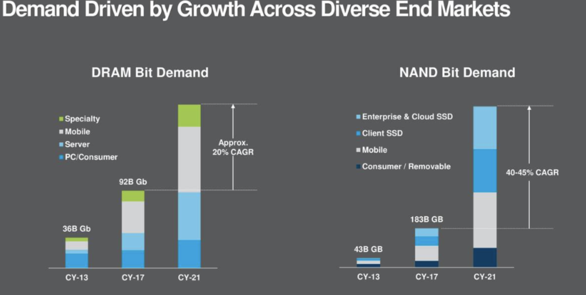

> Note also that in Micron's most recent quarter, the company reported ASPs up on a quarter-over-quarter basis (from 2Q18 to 3Q18) in both DRAM and trade NAND. The crash everyone is expecting hasn't happened yet. Let's say if prices do see a decline. That's normal and fine - but to make up for it, Micron (like most semiconductor manufacturers in any normal year) is also driving dramatic cost improvements. As I noted in my article last week, the CFO noted that he expects ~30% cost reductions on flash memory.

